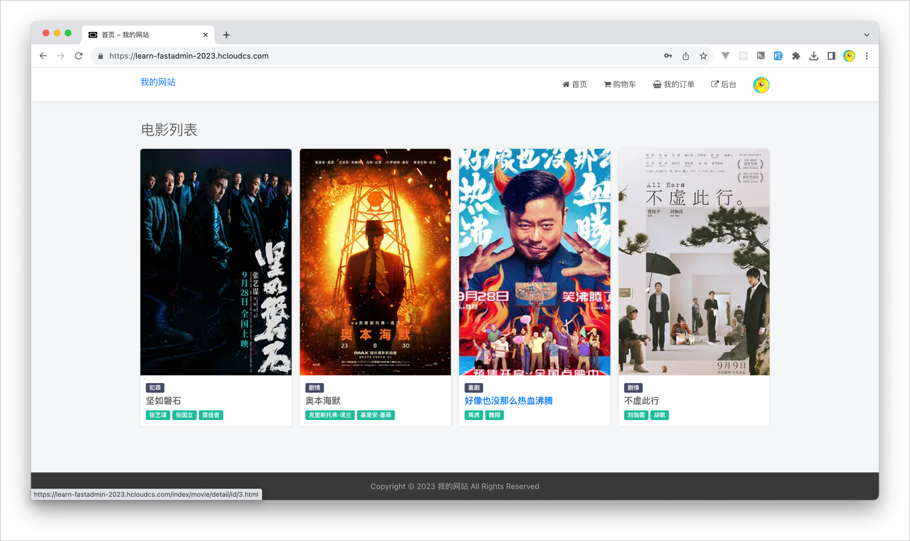
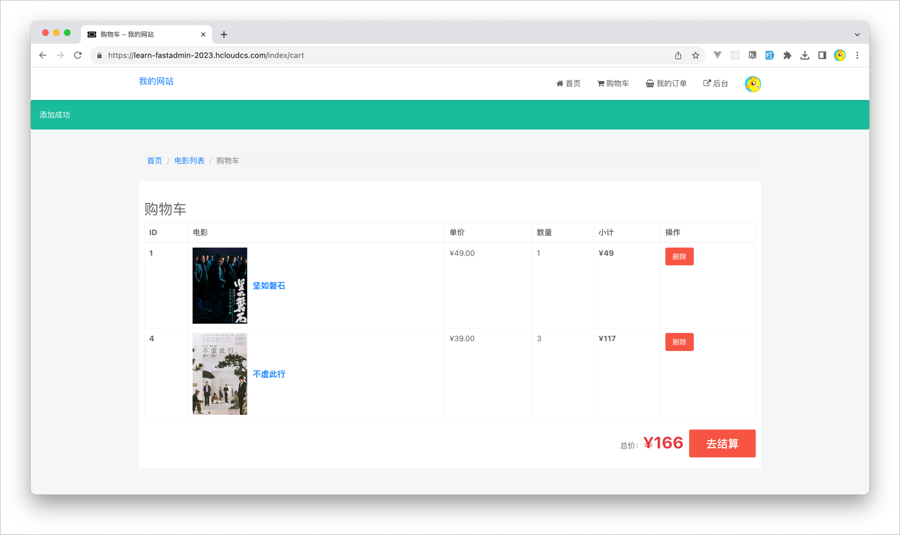
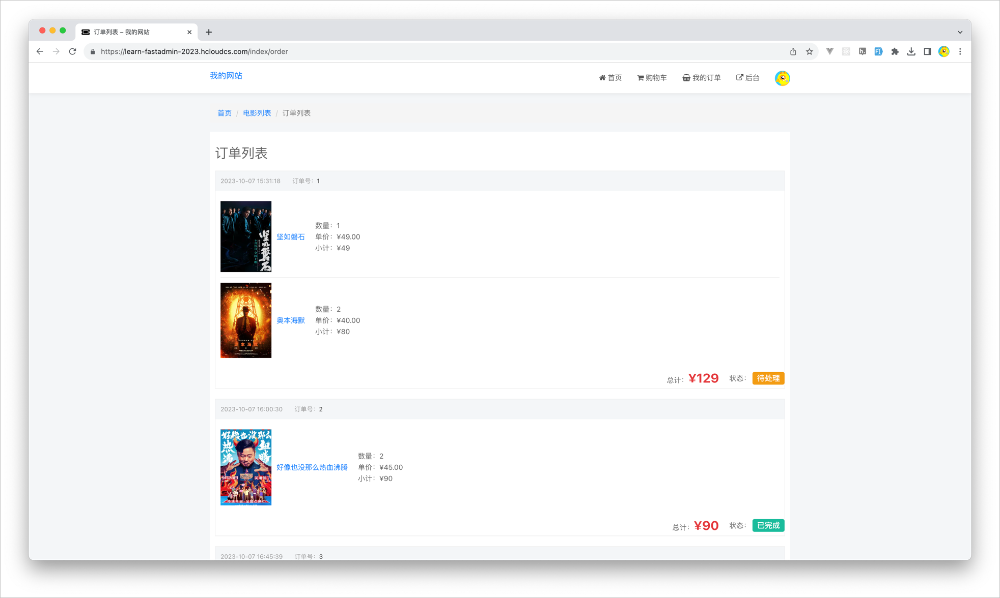
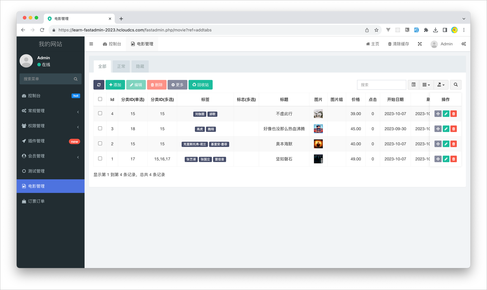
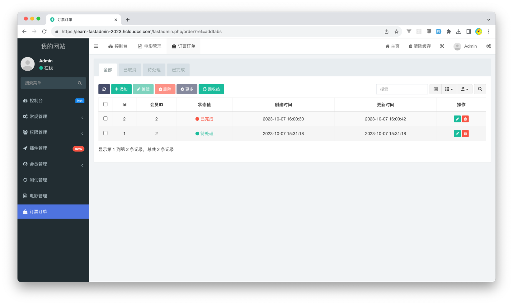

# 学习 FastAdmin

## 项目：订单系统

### 项目说明

我实现了一个简单的订单系统，用来订电影票的。

用户：从前台查看电影信息、加入购物车、下订单、查看订单状态。

管理员：从后台录入电影信息、查看用户的订单、编辑订单状态。

## 测试网址

https://learn-fastadmin-2023.hcloudcs.com/

### 后台管理员账号
 
- 地址：https://learn-fastadmin-2023.hcloudcs.com/fastadmin.php
- 账号：admin
- 密码：admin@admin.com